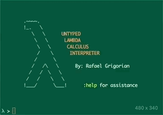
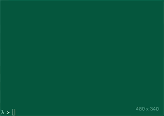

# Lambda
> An untyped lambda calculus interpreter written in Scala


<p align="center" >
	
	
	
</p>

## About
This interpreter was written in **Scala** and is built using the **SBT** build system.  It interprets untyped lambda calculus expressions, and shows each intermediate step that is taken to solving the expression.  Alpha transformations and beta reductions are both shown.  For the beta reductions, __Normal-Order Reduction__ (left-most & outer-most) was used to reduce the expression into __Beta-Normal Form__.  In addition, a symbol table is implemented in order to save expression results and be able to use them in future expressions.  For this very reason dynamic symbol resolution was implemented into the interpreter.  The base CFG that was used was as follows:

```
EXPRESSION 	:= ( EXPRESSION )
               | VARIABLE
               | lambda VARIABLE . EXPRESSION
               | EXPRESSION EXPRESSION
```

Since I built the parser myself, I rearranged this CFG to be left recursive and left associative for function definitions and right associative for function applications.  It also gave presedence to function application over function definition (function definition is greedy).  That produced the following CFG that was used with my **LL(1)** parser:

```
EXPRESSION 	:= ( EXPRESSION ) APPLICATION
               | VARIABLE APPLICATION
               | FUNCTION APPLICATION
EXPRESSION' := ( EXPRESSION )
               | VARIABLE
               | FUNCTION
FUNCTION 	:= lambda VARIABLE . EXPRESSION
APPLICATION := EXPRESSION' APPLICATION
               | ;
```

The AST that was implemented in order to reduce the expression into beta normal form was evaluating the AST nodes use the __call by value__ method.  Also please note that as input, when inputing a function definition, one can type the following strings to represent lambda: __lambda__ or __\\__ or __λ__.  This interpreter stops expression evaluation if it detects infinite expansion and will alert the user if one is detected, whether as a result of a combinator expression directly, or one defined in the symbol table.

## Packages
There are four packages in this implementation.  The __io.raffi.interpreter__ package holds all the classes that are important in evaluating and manipulating the AST as well as parsing user input in an intermediate parser.  The __io.raffi.interpreter.ast__ package holds the AST node classes that contain visitor functions that will aid us in manipulating the expression tree.  The __io.raffi.interpreter.scope__ package contains classes that involve working with the symbol table, scopes, and symbols.  Finally the __io.raffi.interpreter.parser__ package contains the token definitions, as well as the lexer and parser implementations.

## Build System
The following table describes the various commands that can be run in respect to the **SBT** build system.  As a side note, all dependencies can be found in the _lib_ folder.  I decided not to resolve the dependencies using **SBT** in order to get a speed increase in compilation time.  Please note that optionally `sbt "runMain io.raffi.interpreter.Interpreter"` can be executed to run the project.

| **Description** |  **Command**  |
|:---------------:|:-------------:|
| Compile Project | _sbt compile_ |
|  Clean Project  |  _sbt clean_  |
|   Run Project   |   _sbt run_   |
|    Run Tests    |   _sbt test_  |


## Available Commands
| __Command__ |                           __Description__                          |
|:-----------:|:------------------------------------------------------------------:|
|   `:about`  |                    Information about the author                    |
|   `:clear`  |                          Clear the console                         |
|   `:color`  |       Syntax highlight based on binding (green is free vars)       |
|   `:debug`  |                         Turn on debug mode                         |
|   `:exit`   |                      Terminate the interpreter                     |
|  `:global`  |                   Display symbols in global scope                  |
|   `:help`   |                         Show the help menu                         |
|  `:history` | Toggle history setting, show beta reduction steps after completion |
|   `:info`   |                    Behind the scenes description                   |
|   `:quit`   |                      Terminate the interpreter                     |
|   `:reset`  |                 Clear symbols from the symbol table                |
| `:settings` |                      Display current settings                      |

## Debug Mode
In debug mode, the `:color` option and `:history` option are turned on.  This enables free variable highlighting to be colored in green.  Also when the expression is finished evaluating, a complete history of beta reduction (substitutions) are displayed on the screen.  To set the interpreter into debug mode type `:debug` into the console.  This will toggle the debug state.

## Example Use-Case
An example input would be as follows:

```
λ > lambda x y . x u x
```

or we can save it into a variable:

```
λ > variable = lambda x y . x u x
```

and then later use the result of that expression that was saved into the variable into future expressions:

```
λ > variable 3
```

this would result in the following reduction step(s):

```
λ > variable 3

α   (variable 3)
α   ((λx.(λy.((x u) x))) 3)
β   (λy.((3 u) 3))

    Reduced in 1 reduction step(s)
```

## Implementation
The following sequence will describe the implementation that was used to achieve the desired results.

1. Take input from user, if assignment then save expression result into symbol table, else evaluate expression
2. Pass input expression into parser which in-turn passes it to the lexer.
3. The parser builds an __Abstract-Syntax-Tree__ (AST) while parsing the input data.
4. Using this AST pass it to the Evaluator instance, which preforms normal order reduction until expression is in beta normal form.
5. The results are printed, and the intermediate steps are as well, including alpha transformations and beta reductions.

## Limitations
As far as I can tell, this implementation has no limitations, and follows all the requirements for an untyped lambda interpreter.  With extra features of course.

## Additional Notes
When programming this project, I used the following interpreter to verify my results: [https://people.eecs.berkeley.edu/~gongliang13/lambda/#firstPage](https://people.eecs.berkeley.edu/~gongliang13/lambda/#firstPage).  I also adapted some visual implementations based on this online interpreter.
